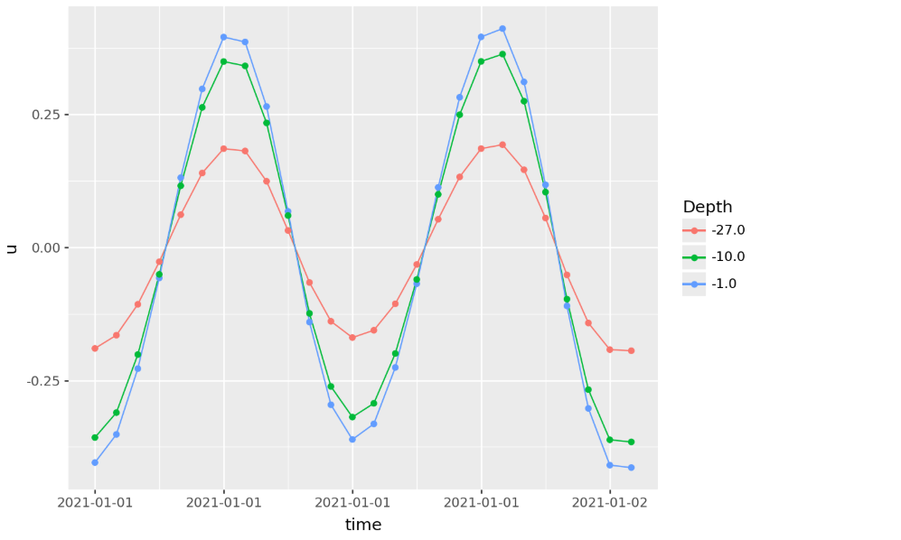

# Getting started

## Installation


1. Install the tidepredictor package from the distributed wheel file. Available on <https://github.com/DHI/tidepredictor/releases>.

E.g. for version 0.1.0:
```bash
pip install https://github.com/DHI/tidepredictor/releases/download/v0.1.0/tidepredictor-0.1.0-py3-none-any.whl
```

2. Copy constituent files (`.nc` files) for both `DTU10` and `FES2014` models to the local machine with the following directory tree:

    ```text
    ~/.local/share/tidepredictor/
    ├── DTU10/
    │   ├── current.nc
    │   └── level.nc
    └── FES2014/
        ├── level/
        │   ├── 2n2.nc
        │   ├── eps2.nc
        │   ├── .
        │   ├── .
        │   ├── .
        │   ├── ssa.nc
        │   └── t2.nc
        └── current/
            ├── eastward_velocity/
            │   ├── 2n2.nc
            │   ├── eps2.nc
            │   ├── .
            │   ├── .
            │   ├── .
            │   ├── ssa.nc
            │   └── t2.nc
            └── northward_velocity/
                ├── 2n2.nc
                ├── eps2.nc
                ├── .
                ├── .
                ├── .
                ├── ssa.nc
                └── t2.nc
    ```

## Usage

`tidepredictor` can be used both as a command-line application and as a Python library. The package currently supports two tidal models: `DTU10` and `FES2014`. The desired model can be selected using the `model_name` keyword argument, with `FES2014` set as the default option.

### Python library

```{python}
import tidepredictor as tp
from datetime import datetime, timedelta

path = tp.get_default_constituent_path(tp.PredictionType.level, model_name="DTU10")

repo = tp.NetCDFConstituentRepository(path, model_name="DTU10")

predictor = tp.LevelPredictor(repo)

df = predictor.predict(
    lon=-2.75,
    lat=56.1,
    start=datetime(2021, 1, 1),
    end=datetime(2021, 1, 1, 12),
    interval=timedelta(hours=1),
)
```

And similar for depth averaged currents.

```{python}
path = tp.get_default_constituent_path(tp.PredictionType.current, model_name="FES2014")

repo = tp.NetCDFConstituentRepository(path, model_name="FES2014")

predictor = tp.CurrentPredictor(repo)

df = predictor.predict_depth_averaged(
    lon=-2.75,
    lat=56.1,
    start=datetime(2021, 1, 1),
    end=datetime(2021, 1, 1, 12),
    interval=timedelta(hours=1)
)
```


And current profiles.

```{python}
path = tp.get_default_constituent_path(tp.PredictionType.current,model_name="DTU10")

repo = tp.NetCDFConstituentRepository(path,model_name="DTU10")

predictor = tp.CurrentPredictor(repo, alpha=1.0/3)

df = predictor.predict_profile(
    lon=-2.75,
    lat=56.1,
    start=datetime(2021, 1, 1),
    end=datetime(2021, 1, 2, 1),
    interval=timedelta(hours=1),
    levels=[-1.0, -10.0, -27.0]
)
```

```{python}
from plotnine import *

(
    ggplot(df, aes("time","u", color="factor(depth)"))
    + geom_line() + geom_point()
    + labs(color="Depth")

)


```



### Command line

```{python}
!tidepredictor -x -2.75 -y 56.1 -s "2021-01-01" -e "2021-01-01 02:00:00" -i 30
```

All options are available as command line arguments.

```{python}
!tidepredictor --help
```